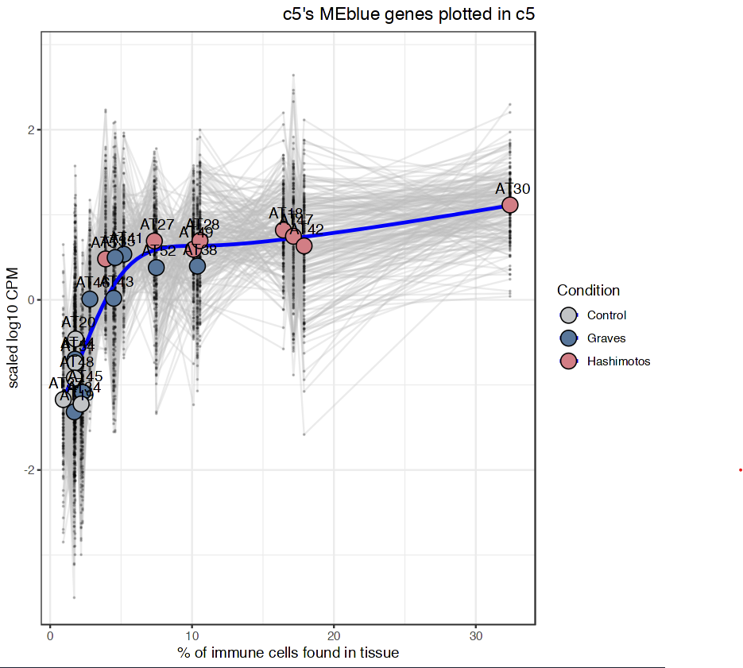

### 1. Data preprocessing and network construction ###
As I work with WGCNA to construct multiple single-cell genes network, I realize that the whole process is quite cumbersome, and the analysis will benefit greatly if we can make reproducible functions for parallel processing of multiple single-cell populations, power detection, module construction, and downstream analysis. Driven by this, I wrote a few functions for my own use. Feel free to use them if you are interested.

The first step in WGCNA network construction is preprocessing of raw reads. Often times for RNA-seq data, such as scRNA-seq, one simple way to normalize would be CPM normalization, 
followed by log1p or log10p. We don’t have to provide scaled data into WGCNA’s pipeline - it is not necessary, and scaling doesnt change correlation, either. Moreover, there are some
internal steps in WGCNA where they would check for missing data or sparseness (in the case that one have many 0s across genes).

This function will read in a metadata, a raw count matrix, remove genes and normalize the matrix using either edgeR or deseq for each cell population:
```R
step1=preprocess_input(meta_file="/projects/Thyroid/Results_nuc/7_NetworkAnalysis/Eco_system/Eco_all_meta.csv",
                          count_file="/projects/Thyroid/Results_nuc/7_NetworkAnalysis/Eco_system/Eco_all_count.csv",
                       vst=T,cluster_label="cluster",sample_label="Channel"
                ,vars_to_keep=c("Channel","immune_infiltration_percent","Condition"),normalize=T,
                          cluster_to_use=c("all"),normalize_method="edgeR",
                        remove_genes=Ig_rm,remove_missing=10)
```

and then one can find the powers  for all populations or for the populations of interest specified in cluster_to_use with :
```R
powers=find_power(step1[[2]])
```
Finally, to construct a network, one can run
```R
net=construct_network(step1[[2]],power_list=powers,save_output="/working-dir/net.RDS")
```

### 2. Visualization of network output ### 
One way to “QC” a gene module as well as visualizing its correlating pattern with a response variable is to plot all the gene expressions and the variable on the same plot. 
This might sound like a lot, especially when you have hundreds if not thousands of genes. One can do the following: select genes that have high module-memberships to the module, 
scale them to be between 0-1, and plot only those genes’ expressions (log10 CPM) against the values of the response variable; simultaneously, plotting the mean trend of the module as well,
e.g. eigengene. For example, in our study, we detect an interesting module that is tightly correlated with immune-infiltration:



